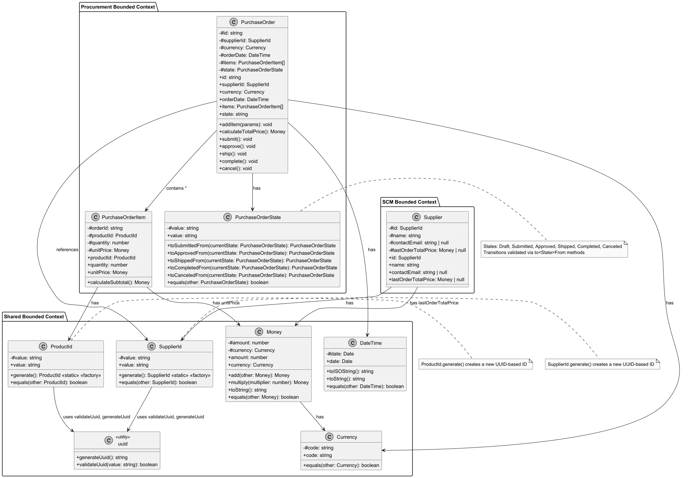

# javascript-review

## Overview
Sample JavaScript console application illustrating object-oriented and domain-driven design principles in the context of Supply Chain Management and Procurement.

## Features
Main  business concepts include:
- Suppliers
- Purchase Orders
- Purchase Order Items
- Money and Currency
- DateTime for order dates
- Bounded Contexts (Shared, SCM, Procurement)
- Domain-specific validations

## Object-Oriented Programming and Domain-Driven Design principles and concepts
The project demonstrates the following principles and concepts:
- Encapsulation: Each class encapsulates its data and behavior.
- Abstraction: Complex logic is abstracted away in methods.
- Single Responsibility Principle: Each class has a single responsibility.
- Bounded Contexts: Different modules represent different domains.
- Value Objects: Money and DateTime are represented as value objects.
- Aggregate Roots: Purchase Order is an aggregate root that manages its items.
- State Management: Purchase Order state transitions are managed through methods.

## User Stories
In the document [docs/user-stories.md](docs/user-stories.md), you can find the user stories that describe the requirements and acceptance criteria for the project.

## Class Diagram
The following class diagram illustrates the relationships between the main classes in the project:


You can review the class diagram in the [docs/class-diagram.puml](docs/class-diagram.puml) file.

## Pre-requisites
- Node.js
- npm

## Dependencies
- uuid (https://www.npmjs.com/package/uuid)

## Installation
```bash
npm install
```
## Running the Project
```bash
npm start
```
## Author
Web Application Development Team

## License
This project is licensed under the MIT License - see [LICENSE.md](LICENSE.md) for details.
